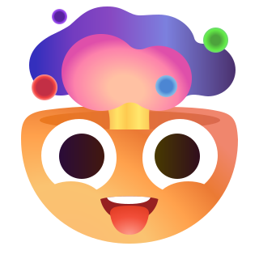
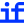
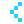
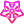
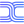
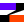

# AI Icons

**中文** | [English](README.md)

> **321 AI / LLM brand icons** in SVG format — Mono · Color · Text variants

[](https://prompthub.gokuscraper.com/icons/)


## 在线预览 & 搜索

👉 **[prompthub.gokuscraper.com/icons/](https://prompthub.gokuscraper.com/icons/)**

在线版提供搜索、筛选、模式切换和一键下载功能，体验更好。

**功能特性：**
- **搜索** — 按名称快速查找图标
- **筛选** — 按 Provider / Model / Application 分类
- **切换** — Color / Mono 模式切换
- **下载** — SVG / PNG / WebP 格式
- **复制** — 一键复制 SVG 代码

### Provider（124 个）

| 图标 | ID | 名称 |
|------|----|------|
|  | `zero-one` | 01.AI (零一万物) |
|  | `ai302` | 302.AI |
|  | `agent-voice` | AgentVoice |
|  | `ai-studio` | AI Studio (Google) |
|  | `ai360` | Ai360 (360智脑) |
|  | `ai-hub-mix` | AiHubMix (推理时代) |
|  | `ai-mass` | AiMass (紫东太初) |
|  | `akash-chat` | AkashChat |
|  | `aleph-alpha` | AlephAlpha |
|  | `alibaba` | Alibaba |
|  | `alibaba-cloud` | AlibabaCloud (阿里云) |
|  | `anspire` | Anspire |
|  | `ant-group` | AntGroup |
|  | `anthropic` | Anthropic |
|  | `anyscale` | Anyscale |
|  | `apertis` | Apertis |
|  | `apple` | Apple |
|  | `atlas-cloud` | AtlasCloud |
|  | `aws` | AWS |
|  | `azure-ai` | AzureAI |
|  | `baidu` | Baidu |
|  | `baidu-cloud` | BaiduCloud (百度智能云) |
|  | `bailian` | Bailian (阿里云百炼) |
|  | `baseten` | Baseten |
|  | `bedrock` | Bedrock (AWS) |
|  | `bilibili` | Bilibili (哔哩哔哩) |
|  | `bfl` | Black Forest Labs (bfl) |
|  | `bocha` | Bocha (博查) |
|  | `brave` | Brave |
|  | `bria-ai` | BRIA AI |
|  | `browserless` | Browserless |
|  | `burn-cloud` | BurnCloud |
|  | `byte-dance` | ByteDance |
|  | `cent-ml` | CentML |
|  | `cerebras` | Cerebras |
|  | `civitai` | Civitai |
|  | `cloudflare` | Cloudflare |
|  | `cohere` | Cohere |
|  | `comet-api` | Comet API |
|  | `crusoe` | Crusoe |
|  | `deep-infra` | DeepInfra |
|  | `deep-mind` | DeepMind (Google) |
|  | `exa` | Exa |
|  | `fal` | Fal |
|  | `featherless` | Featherless.ai |
|  | `fireworks` | Fireworks |
|  | `friendli` | Friendli |
|  | `gitee-ai` | GiteeAI |
|  | `github` | Github |
|  | `google` | Google |
|  | `google-cloud` | GoogleCloud |
|  | `groq` | Groq |
|  | `higress` | Higress |
|  | `huawei` | Huawei |
|  | `huawei-cloud` | HuaweiCloud (华为云) |
|  | `hugging-face` | HuggingFace |
|  | `hyperbolic` | Hyperbolic |
|  | `ibm` | IBM (Granite) |
|  | `i-fly-tek-cloud` | IFlyTekCloud (讯飞开放平台) |
|  | `inference` | Inference |
|  | `infermatic` | Infermatic |
|  | `infinigence` | Infinigence (无问芯穹) |
|  | `intern-lm` | InternLM |
|  | `jina` | Jina AI |
|  | `kagi` | Kagi |
|  | `kluster` | Kluster |
|  | `lambda` | Lambda |
|  | `lepton-ai` | LeptonAI |
|  | `lg` | LG AI (KMMLU/EXAONE) |
|  | `llm-api` | LLM API |
|  | `lm-studio` | LM Studio |
|  | `lobe-hub` | LobeHub |
|  | `menlo` | MENLO (Lucy/Jan-nano) |
|  | `meta` | Meta |
|  | `microsoft` | Microsoft |
|  | `azure` | Microsoft Azure |
|  | `model-scope` | ModelScope (魔搭) |
|  | `moonshot` | Moonshot (月之暗面) |
|  | `nebius` | Nebius |
|  | `new-api` | New API |
|  | `nous-research` | NousResearch (Hermes) |
|  | `novita` | Novita |
|  | `npl-cloud` | NPLCloud |
|  | `nvidia` | Nvidia (Nemotron) |
|  | `ollama` | Ollama |
|  | `open-ai` | OpenAI (ChatGPT) |
|  | `open-router` | OpenRouter |
|  | `parasail` | Parasail |
|  | `perplexity` | Perplexity |
|  | `pi` | Pi Agent |
|  | `ppio` | PPIO |
|  | `qiniu` | Qiniu (七牛云) |
|  | `replicate` | Replicate |
|  | `samba-nova` | SambaNova |
|  | `search1-api` | Search1API |
|  | `search-api` | SearchApi |
|  | `sear-xng` | SearXNG |
|  | `silicon-cloud` | SiliconCloud (SiliconFlow) |
|  | `snowflake` | Snowflake |
|  | `soph-net` | SophNet |
|  | `speed-ai` | SpeedAI |
|  | `stability` | Stability (StableDiffusion) |
|  | `state-cloud` | StateCloud (天翼云) |
|  | `straico` | Straico |
|  | `stream-lake` | StreamLake |
|  | `sub-model` | SubModel |
|  | `targon` | Targon |
|  | `tii` | Technology Innovation Institute (Falcon) |
|  | `tencent` | Tencent |
|  | `tencent-cloud` | TencentCloud (腾讯云) |
|  | `together` | together.ai |
|  | `upstage` | Upstage |
|  | `vercel` | Vercel |
|  | `vertex-ai` | VertexAI (Google) |
|  | `vllm` | vLLM |
|  | `volcengine` | Volcengine (火山引擎) |
|  | `workers-ai` | WorkersAI (Cloudflare) |
|  | `world-router` | WorldRouter |
|  | `xai` | xAI |
|  | `xinference` | Xinference |
|  | `xpay` | Xpay |
|  | `yandex` | Yandex |
|  | `zen-mux` | ZenMux |
|  | `zhipu` | Zhipu (智谱) |

### Model（67 个）

| 图标 | ID | 名称 |
|------|----|------|
|  | `ace` | ACE |
|  | `ai2` | Ai2 |
|  | `ai21` | Ai21Labs (Jamba) |
|  | `aion-labs` | AionLabs |
|  | `arcee` | Arcee |
|  | `assembly-ai` | AssemblyAI |
|  | `aya` | Aya (Cohere) |
|  | `baai` | BAAI (智源研究院) |
|  | `baichuan` | Baichuan (百川) |
|  | `bilibili-index` | Bilibili Index (Index Team) |
|  | `chat-glm` | ChatGLM (智谱) |
|  | `claude` | Claude |
|  | `code-gee-x` | CodeGeeX |
|  | `codex` | Codex (OpenAI) |
|  | `cog-video` | CogVideo |
|  | `cog-view` | CogView |
|  | `command-a` | CommandA (Cohere) |
|  | `dalle` | DALL·E (OpenAI) |
|  | `dbrx` | DBRX (Databricks) |
|  | `deep-cogito` | Deep Cogito |
|  | `deep-seek` | DeepSeek |
|  | `dolphin` | Dolphin (dphnAI) |
|  | `doubao` | Doubao (豆包) |
|  | `eleven-labs` | ElevenLabs |
|  | `essential-ai` | Essential AI |
|  | `fish-audio` | FishAudio (Bert) |
|  | `flux` | Flux (black forest labs) |
|  | `gemini` | Gemini (Google) |
|  | `gemma` | Gemma (Google) |
|  | `glmv` | GLM-V |
|  | `grok` | Grok (xAI) |
|  | `happy-horse` | HappyHorse |
|  | `hunyuan` | Hunyuan (腾讯混元) |
|  | `inception` | Inception Labs |
|  | `inflection` | Inflection |
|  | `kolors` | Kolors (快手可图) |
|  | `kwai-kat` | KwaiKAT (KAT-Coder) |
|  | `kwaipilot` | Kwaipilot |
|  | `liquid` | Liquid |
|  | `l-la-va` | LLaVA |
|  | `long-cat` | LongCat |
|  | `magic` | Magic |
|  | `meshy` | Meshy |
|  | `minimax` | Minimax |
|  | `mistral` | Mistral |
|  | `morph` | Morph |
|  | `nano-banana` | Nano Banana (Google) |
|  | `nova` | Nova (AWS) |
|  | `open-chat` | OpenChat |
|  | `pa-lm` | PaLM (Google) |
|  | `phind` | Phind |
|  | `poolside` | Poolside |
|  | `pruna-ai` | Pruna AI |
|  | `qwen` | Qwen (千问) |
|  | `relace` | Relace |
|  | `reve` | Reve |
|  | `rwkv` | RWKV |
|  | `sense-nova` | SenseNova (商汤) |
|  | `skywork` | Skywork (天工) |
|  | `sora` | Sora (OpenAI) |
|  | `spark` | Spark (讯飞星火) |
|  | `stepfun` | Stepfun (阶跃星辰) |
|  | `voyage` | Voyage |
|  | `wenxin` | Wenxin (文心) |
|  | `xiaomi-mi-mo` | Xiaomi MiMo |
|  | `xuanyuan` | Xuanyuan (度小满轩辕) |
|  | `yi` | Yi (零一万物) |

### Application（130 个）

| 图标 | ID | 名称 |
|------|----|------|
|  | `eleven-x` | 11x |
|  | `adobe` | Adobe |
|  | `agui` | AG-UI |
|  | `agnes-ai` | Agnes AI |
|  | `air-jelly` | AirJelly |
|  | `amp` | Amp |
|  | `antigravity` | Antigravity (Google) |
|  | `ask-verdict` | AskVerdict |
|  | `automatic` | Automatic1111 (SD Webui) |
|  | `cap-cut` | CapCut |
|  | `celesto-ai` | CelestoAI |
|  | `cherry-studio` | Cherry Studio |
|  | `claude-code` | Claude Code |
|  | `cline` | Cline |
|  | `clipdrop` | Clipdrop |
|  | `code-buddy` | CodeBuddy |
|  | `code-flicker` | CodeFlicker |
|  | `colab` | Colab (Google) |
|  | `comfy-ui` | ComfyUI |
|  | `copilot-kit` | CopilotKit |
|  | `coqui` | Coqui |
|  | `coze` | Coze |
|  | `crew-ai` | CrewAI |
|  | `cursor` | Cursor |
|  | `cyber-cut` | CyberCut |
|  | `deep-ai` | DeepAI |
|  | `deep-l` | DeepL |
|  | `devin` | Devin |
|  | `dify` | Dify |
|  | `doc2-x` | Doc2X |
|  | `doc-search` | DocSearch |
|  | `dream-machine` | DreamMachine (Luma) |
|  | `fast-gpt` | FastGPT |
|  | `figma` | Figma |
|  | `firecrawl` | Firecrawl |
|  | `adobe-firefly` | Firefly (Adobe) |
|  | `flora` | Flora |
|  | `flowith` | Flowith |
|  | `gemini-cli` | Gemini CLI |
|  | `github-copilot` | Github Copilot |
|  | `glama` | Glama |
|  | `glif` | Glif |
|  | `goose` | Goose (codename) |
|  | `gradio` | Gradio |
|  | `greptile` | Greptile |
|  | `hailuo` | Hailuo (海螺) |
|  | `haiper` | Haiper |
|  | `hedra` | Hedra |
|  | `hermes-agent` | Hermes Agent |
|  | `ideogram` | Ideogram |
|  | `jimeng` | Jimeng (即梦) |
|  | `junie` | Junie |
|  | `kilo-code` | Kilo Code |
|  | `kimi` | Kimi |
|  | `kiro` | Kiro |
|  | `kling` | Kling (可灵) |
|  | `krea` | Krea |
|  | `lang-chain` | LangChain |
|  | `langfuse` | Langfuse |
|  | `lang-graph` | LangGraph (LangChain) |
|  | `lang-smith` | LangSmith (LangChain) |
|  | `lightricks` | Lightricks |
|  | `live-kit` | LiveKit |
|  | `llama-index` | LlamaIndex |
|  | `lovable` | Lovable |
|  | `lovart` | Lovart |
|  | `luma` | Luma |
|  | `make` | Make |
|  | `manus` | Manus |
|  | `mastra` | Mastra |
|  | `mcp` | MCP (Model Context Protocol) |
|  | `mcp-so` | MCP.so |
|  | `meta-ai` | MetaAI |
|  | `meta-gpt` | MetaGPT |
|  | `bing` | Microsoft Bing |
|  | `copilot` | Microsoft Copilot |
|  | `midjourney` | Midjourney |
|  | `monica` | Monica |
|  | `moxt` | Moxt |
|  | `my-shell` | MyShell |
|  | `n-8-n` | n8n |
|  | `notebook-lm` | NotebookLM |
|  | `notion` | Notion |
|  | `novel-ai` | NovelAI |
|  | `obsidian` | Obsidian |
|  | `open-claw` | OpenClaw (MoltBot/ClawdBot) |
|  | `open-code` | opencode |
|  | `open-hands` | OpenHands |
|  | `open-human` | OpenHuman |
|  | `open-web-ui` | OpenWebUI |
|  | `phidata` | Phidata |
|  | `pika` | Pika |
|  | `pix-verse` | PixVerse |
|  | `player2` | Player2 |
|  | `poe` | Poe |
|  | `pollinations` | Pollinations |
|  | `pydantic-ai` | PydanticAI |
|  | `qingyan` | Qingyan (智谱清言) |
|  | `qoder` | Qoder |
|  | `railway` | Railway |
|  | `recraft` | Recraft |
|  | `replit` | Replit |
|  | `roo-code` | RooCode |
|  | `rss-hub` | RSSHub |
|  | `runway` | Runway |
|  | `silly-tavern` | SillyTavern |
|  | `slock` | Slock |
|  | `smithery` | Smithery |
|  | `suno` | Suno |
|  | `sync` | Sync |
|  | `tavily` | Tavily |
|  | `tiangong` | Tiangong (天工) |
|  | `topaz-labs` | TopazLabs |
|  | `trae` | TRAE |
|  | `tripo` | Tripo |
|  | `turi-x` | TuriX |
|  | `udio` | Udio |
|  | `unstructured` | Unstructured |
|  | `v-0` | V0 (Vercel) |
|  | `vectorizer-ai` | Vectorizer.AI |
|  | `venice` | Venice |
|  | `vidu` | Vidu |
|  | `viggle` | Viggle |
|  | `windsurf` | Windsurf |
|  | `you-mind` | YouMind |
|  | `yuanbao` | Yuanbao (腾讯元宝) |
|  | `zai` | Z.ai |
|  | `zapier` | Zapier |
|  | `zeabur` | Zeabur |
|  | `zencoder` | Zencoder |

## 目录结构

```
ai-icons/
├── svgs/
│   ├── openai/          # 每个图标单独一个文件夹
│   │   ├── openai.svg
│   │   ├── openai-color.svg
│   │   └── openai-text.svg
│   ├── claude/
│   │   ├── claude.svg
│   │   ├── claude-color.svg
│   │   └── claude-text.svg
│   └── ...
├── icon-toc.json
├── assets/
│   └── screenshot.jpg
├── README.md
├── README.zh.md
└── .gitignore
```

## 命名规则

| 文件模式 | 说明 |
|---|---|
| `{name}.svg` | 单色版（Mono） |
| `{name}-color.svg` | 彩色版（Color） |
| `{name}-text.svg` | 文字版（Text） |

## 致谢

感谢 [LobeHub Icons](https://github.com/lobehub/lobe-icons) 提供的原始图标资源

感谢 [Goku Prompt Hub](https://prompthub.gokuscraper.com) 提供的图标管理与展示平台

## License

MIT
